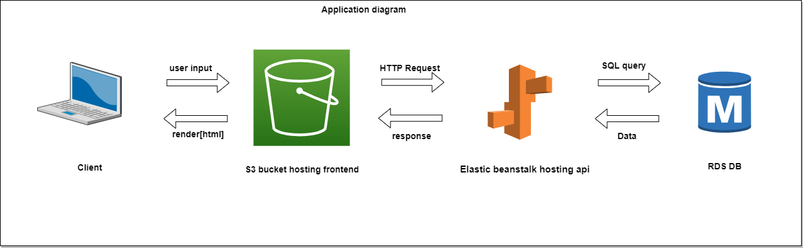

## AWS
- The Application Hosted on AWS Cloud Infrastructure Useing Services S3,EB,RDS 
- The Application Backend Core And API is Setted Up On EB (Elastic Beanstalk)
- The Application Frontend Files And FrontEnd Hosted On S3 Bucket Service
- The Database is Hosted Useing RDS Service and The Database Type is : Postgresql
## Infrastructure Diagram :

## Some Screen Screenshots :
- AWS RDS Service   

- AWS Service EB

- AWS S3 Service - Bucket: http://crypt00o.s3-website-us-east-1.amazonaws.com

