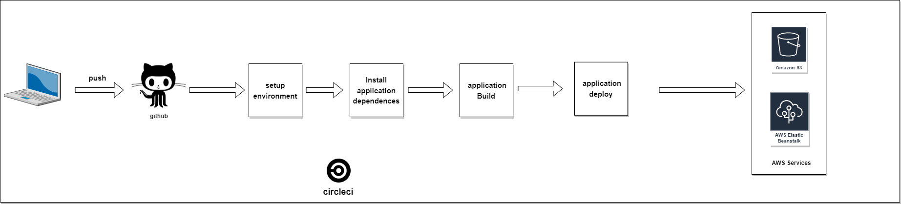
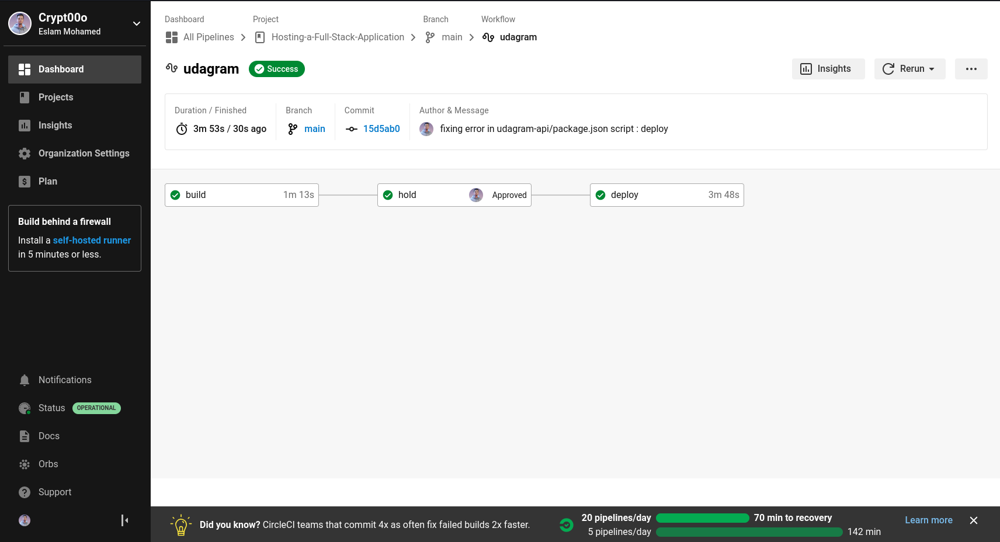
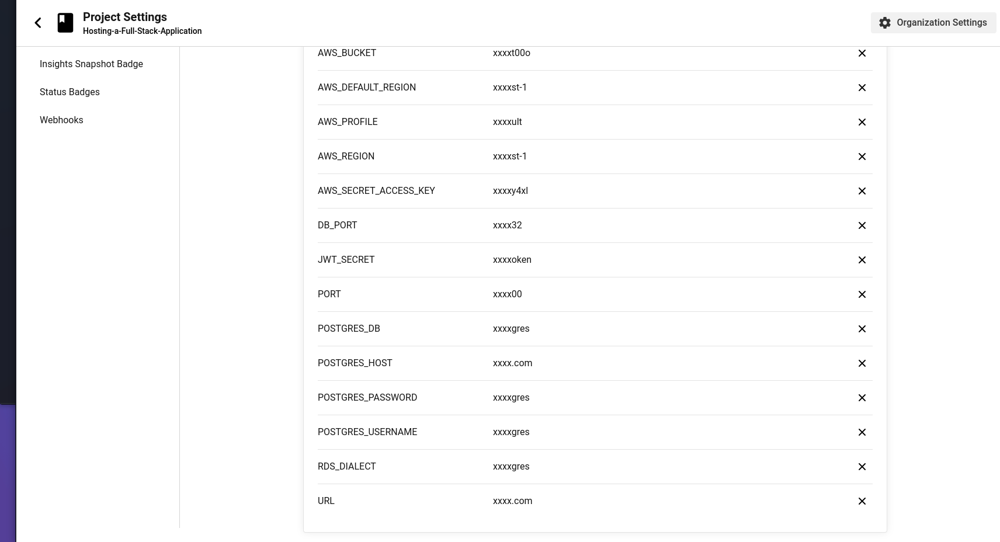

## CI Pipeline
- Project Added on Circle Ci 
- Circle Ci Configed And Then Automaticlly Build Application compenents and Deploy it on AWS Services
- Circle Ci use the main branch in repository then it deploy code on every new commit in the main branch in repository
- CI Pipeline :
  
- CI Pipline Build  & Deploy
  

- CI Deploy Steps
  

- CI Setting Environment Vars
